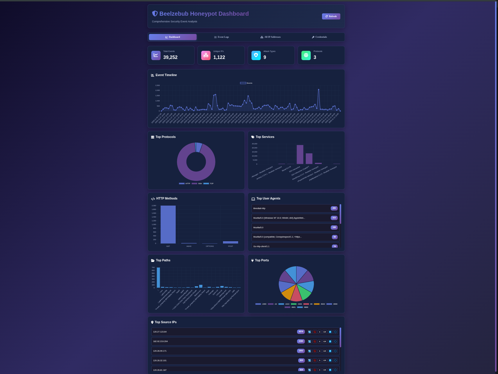
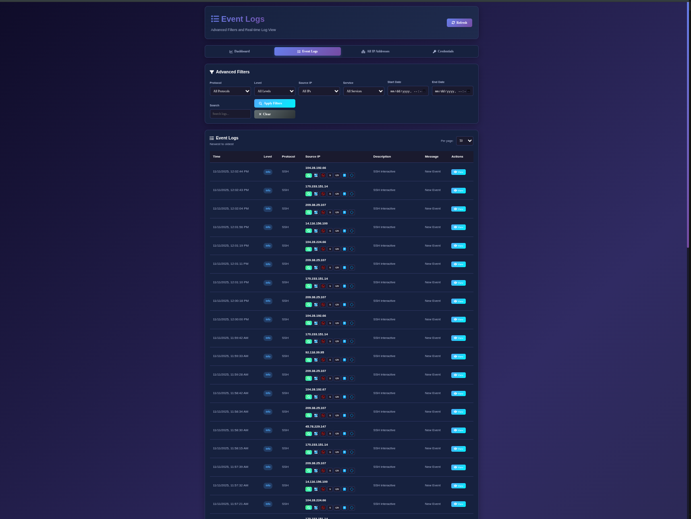
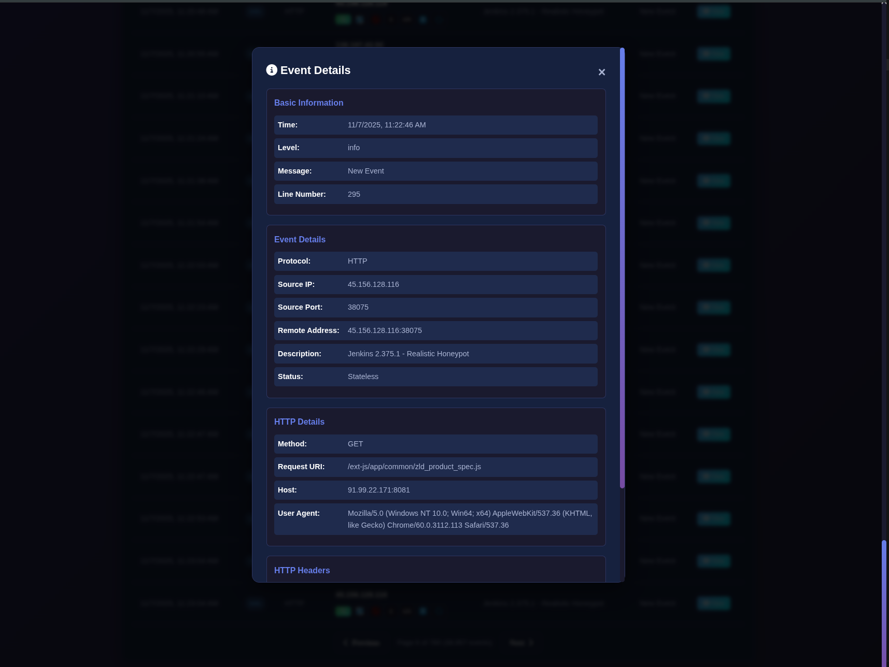
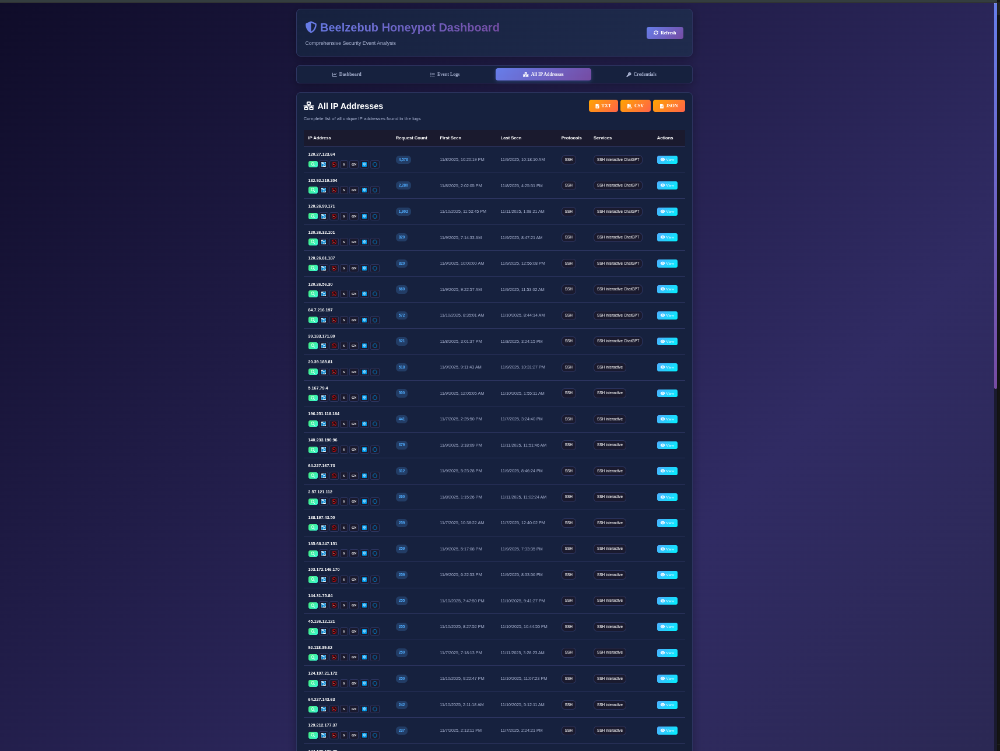
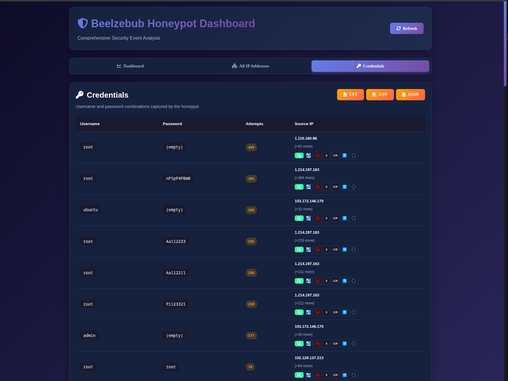

# Beelzebub Honeypot Dashboard

A real-time web dashboard for analyzing [Beelzebub](https://github.com/mariocandela/beelzebub) honeypot logs with  filtering capabilities and a nice data visualizations.

This dashboard is fed with real-world honeypot traffic, reflecting live attack behavior rather than synthetic data.


## Quick Start

### Prerequisites
- Python 3.8 or higher
- pip (Python package manager)
- Beelzebub honeypot log file (JSON format)

### Installation

1. **Clone the repository:**
```bash
git clone https://github.com/ssnrshnn/beelzebubHoneypot.git
cd beelzebubHoneypot
```

2. **Install dependencies:**
```bash
pip install -r requirements.txt
```

3. **Prepare your log file:**
```bash
# Copy your Beelzebub log file to the dashboard directory
cp /path/to/your/beelzebub.log .

# Or use the example file to test
cp beelzebub.log.example beelzebub.log
```

### Running the Dashboard

**Option 1: Use the start script (Recommended)**
```bash
chmod +x start_dashboard.sh
./start_dashboard.sh
```

### Access the Dashboard

Open your web browser and navigate to:
```
http://localhost:5000
```

Or from another machine on the network:
```
http://YOUR_IP_ADDRESS:5000
```

## Screenshots

Below are some snapshots of the dashboard. Images are stored in the `screenshots/` directory and will render on GitHub. The screenshots showcase real attack data captured in the wild.












##  Configuration

### Changing the Port

Edit `app.py` and modify the last line:
```python
app.run(debug=True, host='0.0.0.0', port=YOUR_PORT)
```

### Changing the Log File

Edit `app.py` and modify the `LOG_FILE` constant:
```python
LOG_FILE = 'path/to/your/logfile.log'
```


### Example API Usage

```bash
# Get statistics
curl http://localhost:5000/api/statistics

# Get filtered logs
curl "http://localhost:5000/api/logs?protocol=HTTP&per_page=50"

# Analyze an IP
curl http://localhost:5000/api/ip-analysis/192.168.1.100
```

### Threat Intelligence Shortcuts

The dashboard includes quick access buttons to multiple threat intelligence services for every IP address:

**Available Services:**
- **VirusTotal** - Malware and threat detection analysis
- **AbuseIPDB** - IP reputation and abuse reports
- **Shodan** - Internet-connected device intelligence
- **GreyNoise** - Internet-wide scan and attack activity
- **IPinfo.io** - IP geolocation and network information
- **Talos Intelligence** - Cisco threat intelligence and reputation

**Where to Find Them:**
- **Logs Table**: Each IP has 4 quick-access buttons (VirusTotal, AbuseIPDB, Shodan, GreyNoise)
- **Top IPs List**: Quick buttons for the most common services
- **IP Analysis Modal**: Full set of 6 threat intelligence buttons with labels

**Usage:**
- Click any threat intelligence button to open that service's IP lookup page in a new tab
- No API keys required—all links use public web interfaces
- Perfect for quick reputation checks during incident investigation

##  Log Format

The dashboard expects JSON-formatted log entries with this structure:

```json
{
  "time": "2025-11-06T17:30:36Z",
  "level": "info",
  "msg": "New Event",
  "event": {
    "Protocol": "HTTP",
    "SourceIp": "192.168.1.148",
    "SourcePort": "58406",
    "Description": "WordPress 6.0.2 - Realistic Honeypot",
    "HTTPMethod": "GET",
    "RequestURI": "/",
    "UserAgent": "Mozilla/5.0...",
    ...
  }
}
```


## Project Structure

```
beelzebub-dashboard/
├── app.py                # Flask backend server
├── beelzebub.log         # Your honeypot logs (not in repo)
├── requirements.txt      # Python dependencies
├── start_dashboard.sh    # Convenient start script
├── README.md             # This file
├── screenshots/          # Dashboard screenshots shown below
├── templates/
│   └── index.html        # Dashboard HTML
└── static/
    ├── css/
    │   └── style.css     # Dashboard styling
    └── js/
        └── app.js        # Dashboard functionality
```