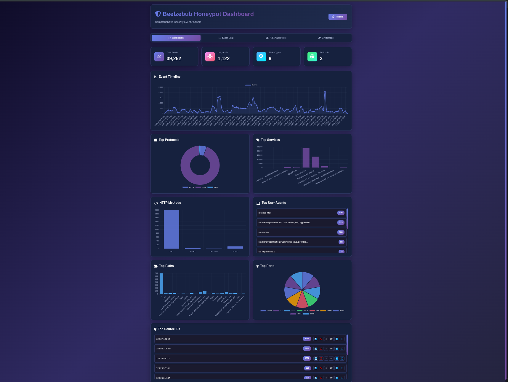
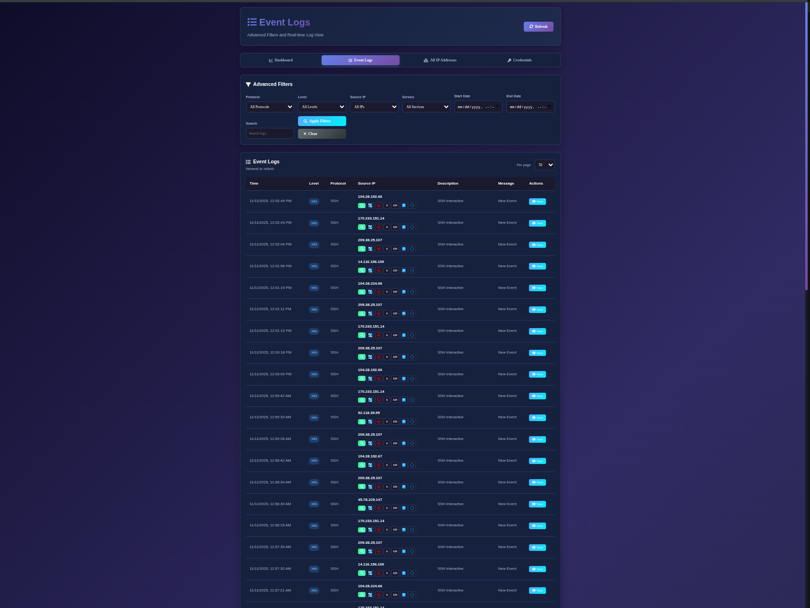
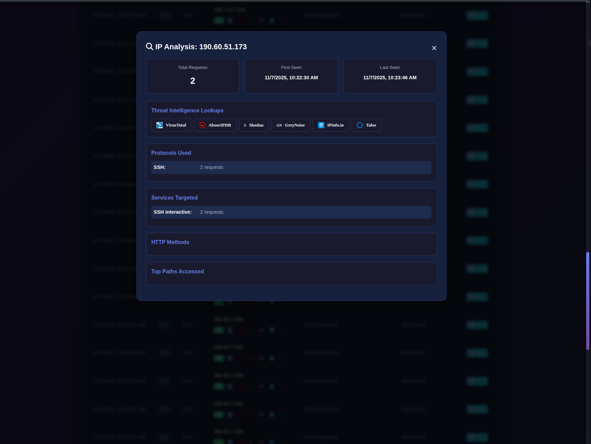
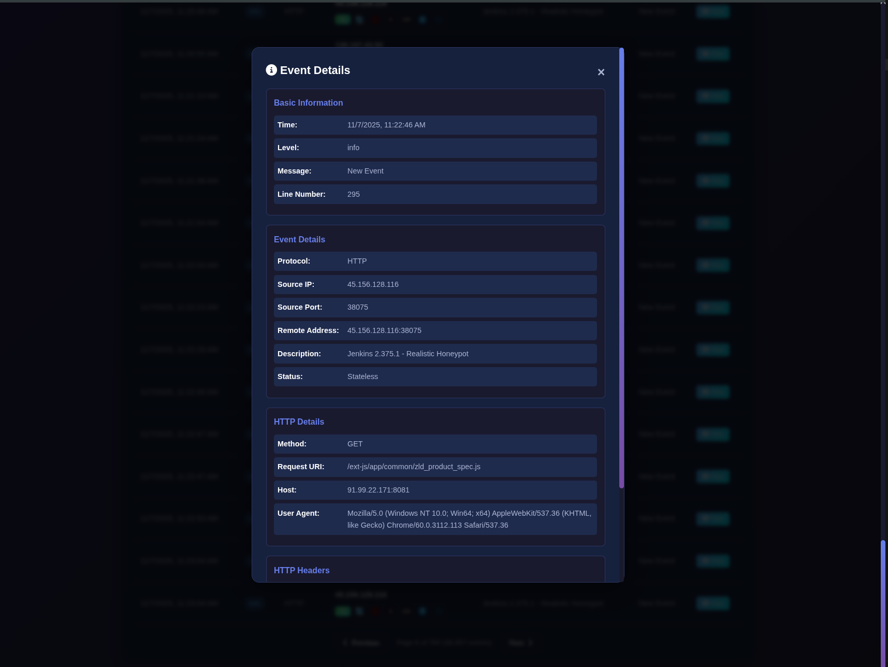
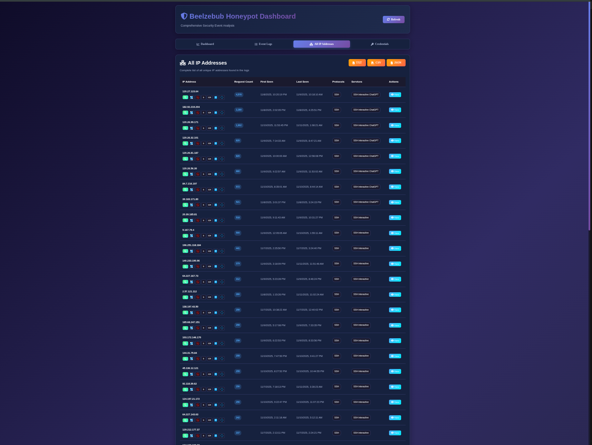
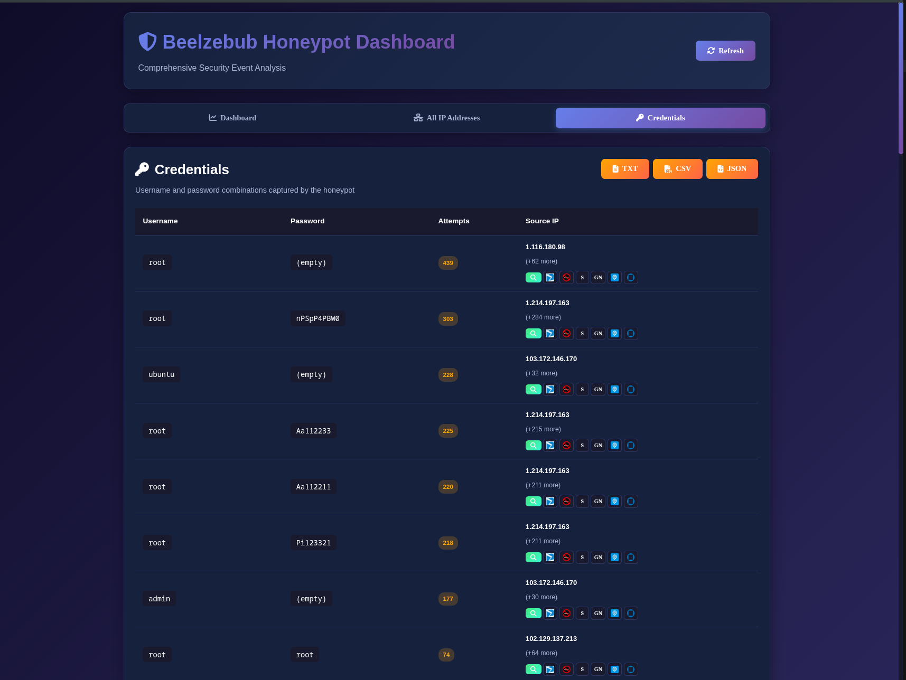

# Beelzebub Honeypot Dashboard

A comprehensive real-time web dashboard for analyzing [Beelzebub](https://github.com/mariocandela/beelzebub) honeypot logs with advanced filtering capabilities, search functionality, and rich data visualizations.

This dashboard is fed with real-world honeypot traffic, reflecting live attack behavior rather than synthetic data. It supports multiple log formats including Beelzebub logs and Suricata IDS logs.


## Quick Start

### Prerequisites
- Python 3.8 or higher
- pip (Python package manager)
- Beelzebub honeypot log files (JSON format) or Suricata log files

### Installation

1. **Clone the repository:**
```bash
git clone https://github.com/ssnrshnn/beelzebubHoneypot.git
cd beelzebubHoneypot
```

2. **Install dependencies:**
```bash
pip install -r requirements.txt
```

### Running the Dashboard

**Option 1: Use the start script (Recommended)**
```bash
chmod +x start_dashboard.sh
./start_dashboard.sh
```

### Access the Dashboard

Open your web browser and navigate to:
```
http://localhost:5000
```

Or from another machine on the network:
```
http://YOUR_IP_ADDRESS:5000
```

## Screenshots

Below are some snapshots of the dashboard. Images are stored in the `screenshots/` directory and will render on GitHub. The screenshots showcase real attack data captured in the wild.













##  Configuration

### Changing the Port

Edit `app.py` and modify the last line:
```python
app.run(debug=True, host='0.0.0.0', port=YOUR_PORT)
```

### Log File Configuration

The dashboard automatically loads all log files from the `logs/` directory. Supported formats:

- **Beelzebub Logs**: `protocol-port.log` format (e.g., `ssh-22.log`, `http-80.log`)
- **Suricata EVE JSON**: `eve.json` file
- **Suricata Fast Log**: `fast.log` file

The dashboard detects protocol and port from filenames automatically. Place your log files in the `logs/` directory and they will be loaded on startup.

**Example log file structure:**
```
logs/
├── ssh-22.log
├── http-80.log
├── http-8080.log
├── ftp-21.log
├── eve.json
└── fast.log
```


### Threat Intelligence Shortcuts

The dashboard includes quick access buttons to multiple threat intelligence services for every IP address:

**Available Services:**
- **VirusTotal** - Malware and threat detection analysis
- **AbuseIPDB** - IP reputation and abuse reports
- **Shodan** - Internet-connected device intelligence
- **GreyNoise** - Internet-wide scan and attack activity
- **IPinfo.io** - IP geolocation and network information
- **Talos Intelligence** - Cisco threat intelligence and reputation

**Where to Find Them:**
- **Logs Table**: Each IP has 4 quick-access buttons (VirusTotal, AbuseIPDB, Shodan, GreyNoise)
- **Top IPs List**: Quick buttons for the most common services
- **IP Analysis Modal**: Full set of 6 threat intelligence buttons with labels

**Usage:**
- Click any threat intelligence button to open that service's IP lookup page in a new tab
- No API keys required—all links use public web interfaces
- Perfect for quick reputation checks during incident investigation


## Project Structure

```
beelzebub-dashboard/
├── app.py                # Flask backend server with API endpoints
├── requirements.txt      # Python dependencies
├── start_dashboard.sh    # Convenient start script with port detection
├── README.md             # This file
├── .gitignore            # Git ignore rules
├── logs/                 # Log files directory (not in repo)
│   ├── ssh-22.log        # SSH logs
│   ├── http-80.log       # HTTP logs
│   ├── eve.json          # Suricata EVE JSON logs
│   └── fast.log          # Suricata fast log
├── screenshots/          # Dashboard screenshots
├── templates/
│   ├── index.html        # Main dashboard HTML
│   └── events.html       # Event logs page HTML
└── static/
    ├── css/
    │   └── style.css     # Dashboard styling
    └── js/
        └── app.js        # Dashboard functionality and API integration
```
